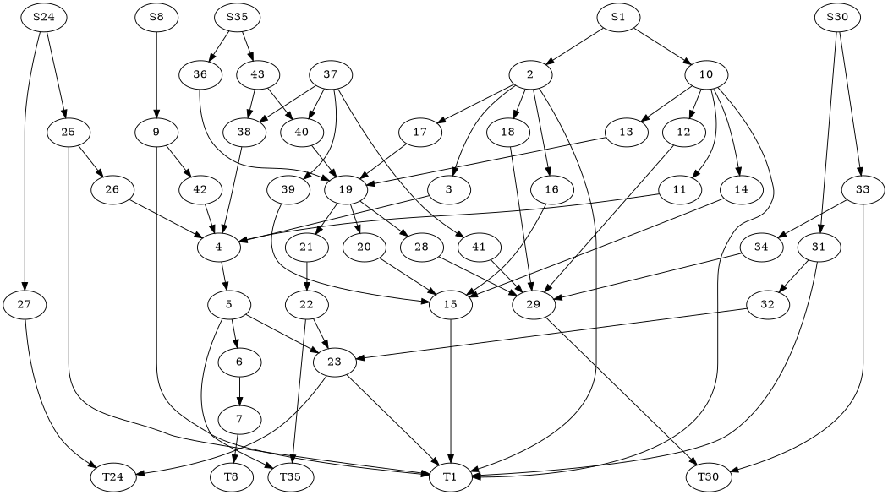
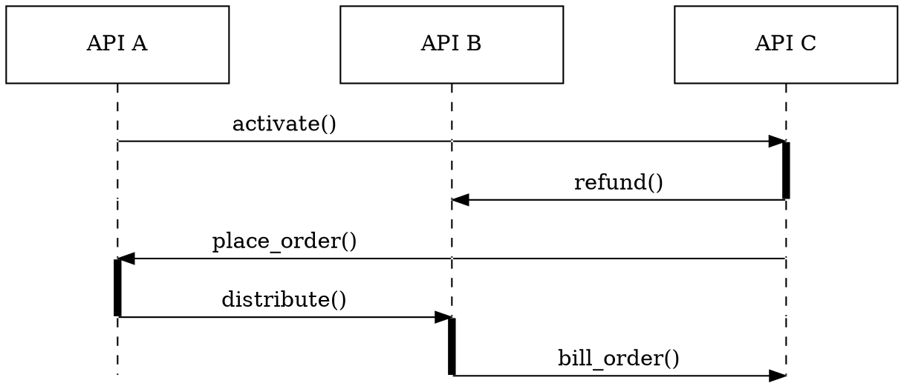

## Install

```bash
npm install @code-blocks/graphviz
```

Use with [rehype](https://github.com/rehypejs/rehype) or [eleventy](https://www.11ty.dev/). See how [here](/).

## Usage

**language: `graphviz`**

This package uses [viz.js](https://github.com/mdaines/viz.js). Try the online editor, [here](http://viz-js.com/). For information on the syntax, checkout the [graphviz documentation](https://graphviz.org/).

### A basic example

```
digraph G {Hello->World}
```

```graphviz
---
className: graphviz-example-1
---
digraph G {Hello->World}
```

### A more complex example

```
digraph world {
size="7,7";
	{rank=same; S8 S24 S1 S35 S30;}
	{rank=same; T8 T24 T1 T35 T30;}
	{rank=same; 43 37 36 10 2;}
	{rank=same; 25 9 38 40 13 17 12 18;}
	{rank=same; 26 42 11 3 33 19 39 14 16;}
	{rank=same; 4 31 34 21 41 28 20;}
	{rank=same; 27 5 22 32 29 15;}
	{rank=same; 6 23;}
	{rank=same; 7;}

	S8 -> 9;
	S24 -> 25;
	S24 -> 27;
	S1 -> 2;
	S1 -> 10;
	S35 -> 43;
	S35 -> 36;
	S30 -> 31;
	S30 -> 33;
	9 -> 42;
	9 -> T1;
	25 -> T1;
	25 -> 26;
	27 -> T24;
	2 -> {3 ; 16 ; 17 ; T1 ; 18}
	10 -> { 11 ; 14 ; T1 ; 13; 12;}
	31 -> T1;
	31 -> 32;
	33 -> T30;
	33 -> 34;
	42 -> 4;
	26 -> 4;
	3 -> 4;
	16 -> 15;
	17 -> 19;
	18 -> 29;
	11 -> 4;
	14 -> 15;
	37 -> {39 ; 41 ; 38 ; 40;}
	13 -> 19;
	12 -> 29;
	43 -> 38;
	43 -> 40;
	36 -> 19;
	32 -> 23;
	34 -> 29;
	39 -> 15;
	41 -> 29;
	38 -> 4;
	40 -> 19;
	4 -> 5;
	19 -> {21 ; 20 ; 28;}
	5 -> {6 ; T35 ; 23;}
	21 -> 22;
	20 -> 15;
	28 -> 29;
	6 -> 7;
	15 -> T1;
	22 -> T35;
	22 -> 23;
	29 -> T30;
	7 -> T8;
	23 -> T24;
	23 -> T1;
}
```



### A sequence diagram 

```
digraph SEQ_DIAGRAM {
    graph [overlap=true, splines=line, nodesep=1.0, ordering=out];
    edge [arrowhead=none];
    node [shape=none, width=0, height=0, label=""];

    {
        rank=same;
        node[shape=rectangle, height=0.7, width=2];
        api_a[label="API A"];
        api_b[label="API B"];
        api_c[label="API C"];
    }
    // Draw vertical lines
    {
        edge [style=dashed, weight=6];
        api_a -> a1 -> a2 -> a3;
        a3 -> a4 [penwidth=5, style=solid];
        a4 -> a5;
    }
    {
        edge [style=dashed, weight=6];
        api_b -> b1 -> b2 -> b3 -> b4;
        b4 -> b5 [penwidth=5; style=solid];
    }
    {
        edge [style=dashed, weight=6];
        api_c -> c1;
        c1-> c2 [penwidth=5, style=solid];
        c2 -> c3 -> c4 -> c5;
    }
    // Draws activations
    { rank=same; a1 -> b1 [label="activate()"]; b1 -> c1 [arrowhead=normal]; }
    { rank=same; a2 -> b2 [style=invis]; b2 -> c2 [label="refund()", arrowhead=normal, dir=back]; }
    { rank=same; a3 -> b3 [arrowhead=normal, dir=back, label="place_order()"]; b3 -> c3; }
    { rank=same; a4 -> b4 [label="distribute()", arrowhead=normal]; }
    { rank=same; a5 -> b5 [style=invis]; b5 -> c5 [label="bill_order()", arrowhead=normal]; }
}
```



Based on [this stackoverflow answer](https://stackoverflow.com/questions/1491322/graphviz-top-to-bottom-and-left-to-right).